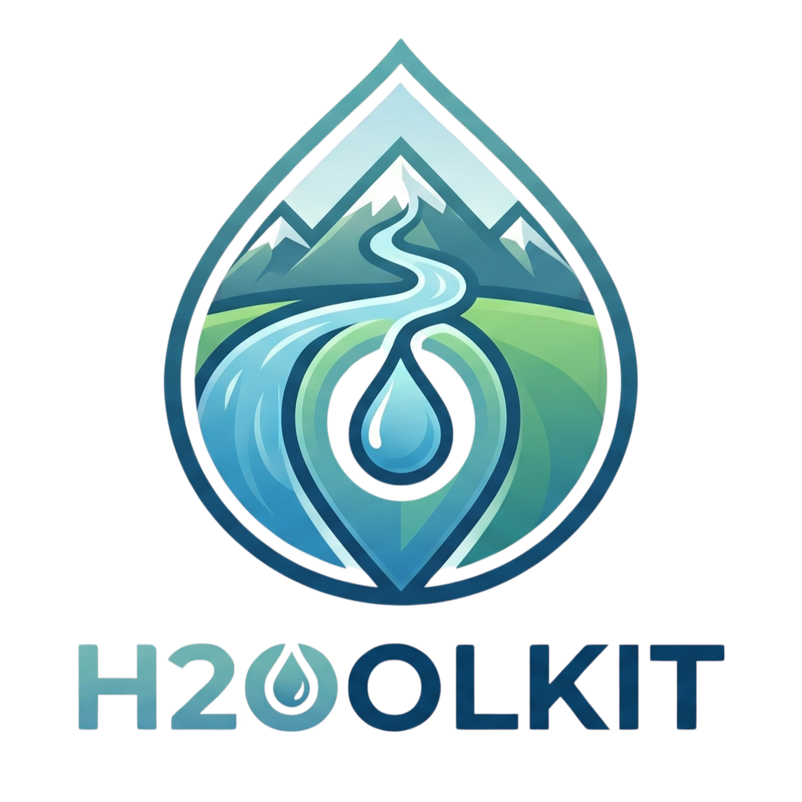

# H2Oolkit

**Spring & Water Source Detection Platform**

H2Oolkit is an open-source web application that helps identify and rank potential water sources for rural communities. It combines real-time data from OpenStreetMap and the EU-Hydro database with Copernicus Sentinel-1 / Sentinel-2 satellite imagery to score the feasibility of supplying water from springs, streams, lakes and rivers to a chosen collection point.



---

## Features

- **Interactive map** (Leaflet) for selecting a collection point and search radius.
- **Multi-source water discovery** — OpenStreetMap layers and EU-Hydro spring/river database.
- **Feasibility analysis** — elevation, distance, population demand, seasonal flow and cost estimation.
- **Satellite-assisted spring detection** via Google Earth Engine (Sentinel-1 / Sentinel-2).
- **Route & cost calculator** for piping water from a source to a village.
- **PDF reports** generated server-side with ReportLab.
- **Dark mode** and responsive UI.

---

## Project Structure

```
H2Oolkit/
├── index.html              Frontend entry point
├── css/                    Stylesheets        → see css/README.md
├── js/                     Frontend logic     → see js/README.md
├── backend/                Flask API & engine → see backend/README.md
├── H2Oolkit.png            Logo
├── setup.bat / run.bat     Windows helpers
├── SETUP.md                Detailed setup & troubleshooting guide
└── README.md               This file
```

---

## Data Setup (required)

H2Oolkit uses the **EU-Hydro River Network Database** to cross-reference water sources
against official European hydrological data. This file is **not included in the repository**
(it is 354 MB — too large for git) and must be downloaded separately before first run.

### Download steps

1. Go to [Copernicus Land Monitoring Service — EU-Hydro](https://land.copernicus.eu/en/products/eu-hydro/eu-hydro-river-network-database)
2. Select **Romania** as the country/region filter
3. Choose format **GeoPackage (GPKG)** and projection **EPSG 4326**
4. Download and place the file at:
   ```
   backend/data/EU-Hydro.gpkg
   ```
   Create the `backend/data/` folder if it does not exist.

> **Without this file** the app still works — OSM water sources and satellite analysis
> remain fully functional. Only the EU-Hydro lake/reservoir sources and official
> water-body cross-referencing are skipped, and the log will show a warning.

---

## Quick Start

### Windows
1. Double-click `setup.bat` and wait for it to finish.
2. Double-click `run.bat`.
3. Open <http://localhost:8000> in your browser.

### Mac / Linux
```bash
# 1. Create and activate a virtual environment
python3 -m venv venv
source venv/bin/activate

# 2. Install dependencies
pip install -r backend/requirements.txt

# 3. Start the backend (port 5000)
venv\Scripts\python.exe -m backend.server     # port 5000
//python -m backend.server

# 4. In a separate terminal, start the frontend (port 8000)
npx serve .
//python -m http.server 8000
```

Then open <http://localhost:8000>.

For full instructions, requirements and troubleshooting see [SETUP.md](SETUP.md).

---

## Requirements

- Python 3.9+
- A modern browser (Chrome, Firefox, Edge, Safari)
- Optional: a Google Earth Engine account for satellite-based spring detection

Python dependencies are listed in [backend/requirements.txt](backend/requirements.txt).

---

## Architecture

```
 ┌──────────────┐   HTTP    ┌─────────────────┐   HTTP/JSON   ┌────────────────────┐
 │   Browser    │──────────▶│  Flask backend  │──────────────▶│  External services │
 │ (index.html, │           │  (backend/)     │               │  OSM, EU-Hydro,    │
 │  js/, css/)  │◀──────────│                 │◀──────────────│  Earth Engine, …   │
 └──────────────┘   JSON    └─────────────────┘               └────────────────────┘
```

The frontend is a static site served on port `8000`. It calls the Flask API on port `5000`, which fans out to OSM Overpass, the EU-Hydro database, elevation services and (optionally) Google Earth Engine to assemble ranked water-source results.

---

## Contributing

Contributions are welcome. Please:

1. Fork the repository and create a feature branch.
2. Keep changes focused and add a short description in the PR.
3. Make sure the backend still starts (`python -m backend.server`) and the frontend loads without console errors.

---

## License

This project is open-source. See the repository for license details.
